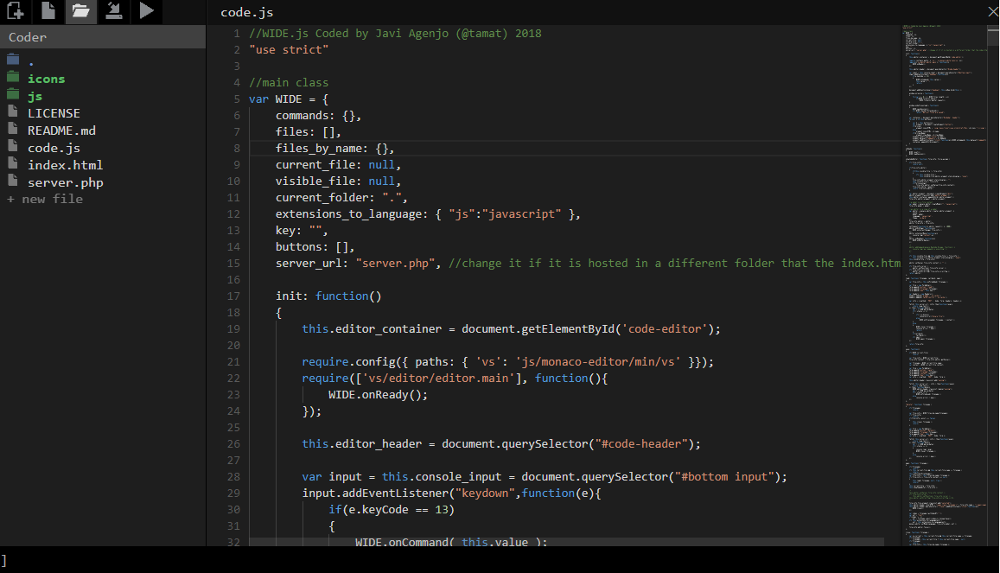

# wide

WIDE is a Web IDE based in monaco-editor, it allows to edit remote files in your own server quite easily, instead of having to use local files or uploading files through SFTP.

It allows to open several files, to browser remote folders, and the privileges are based in a config.json that you can store server side.



## Features

- Cool text editor with nice syntax highlighting (uses monaco-editor, the editor from VSCode).
- Load/Save remote files 
- Browse server files easily and fast
- Saves/Restores the session (restores the last open files when reopening the editor)
- Console to launch commands (easy to add new ones) or to visualize logs
- Allows to "execute" the project (and see the result in the editor console)
- Very simple and light-weight, only three files in total (html,js,php), does not use any build script.
- Easy to install (does not require launching any daemon or having to configure a database).
- Allows to work with big files
- Supports unix-like commands (cd,ls,open) in the console with autocompletion according to the current folder in the server

## Keys

- ```Control + O```: open console
- ```Control + Enter```: execute current file
- ```Control + Q```: go to console bar
- ```Control + S```: save
- ```Shift + Control + 1-9```: switch to open file

## Commands

- ```list```: list files in a given folder
- ```load```: loads a file from the server
- ```save```: save file to server
- ```new```: create a file locally
- ```delete```: delete file in the server

and unix like commands like ```cd```,```ls```

## Security

The way it allows users to access files in the server is by using keys (tokens) that grant you access to specific server folders.
This means that if a malicious user obtains a key, he could not only store files in the server but also execute malicious code, which is quite dangerous.

Keys are stored in a config file called ```wide_config.json``` that contains keys associated to folders. This file should never be accessible through HTTP, otherwise the keys will be public. We recommend to store the config in ```/home/your_username```.

The first time using the editor in a browser you must set the key (using the lower console bar or the key input), and it is stored in localStorage so you do not need to type it everytime, but it is stored in plain text (so anyone being able to access the computer could extract it).

When accessing the server (load file, store, browse) it sends the key in the request header (in plain text, so always use HTTPS), and the server checks if the key matches any of the keys in its project list (configured in the ```wide_config.json```). If the server has the ```use_md5``` feature enabled, it will hash first the key using md5 and then compare it with the one in the config file.

This is a layer of security that helps in case the config file is accessed by a malicious user, but it could still be easily hacked using an attack by dictionary.

So it is safe but not perfect, so my recommendation is **do not use wide.js if your code is very sensitive to people trying to hack you**, unless you are aware of the consequences.

## Installation

Copy all repository files to a folder in your host accessible from HTTPS.

Create the ```wide_config.json``` in a folder **that is not accessible through HTTP**, like ```/home/``` or ```/home/YOUR_USERNAME```. If the ```wide_config.json``` is accessible through HTTP people will be able to see your keys (although if they are in md5 it still requires some work to get the key) and have access to execute malicious code in your host, so you will have a serious security risk in your server, be careful.

The config should be like this:

```json
{
        "projects":{
                "PROJECT_KEY": {
                        "name":"Project1",
                        "folder":"/srv/www/mysite.com/www/public_html/",
                        "play":"http://mysite.com/"
                },
                "PROJECT_KEY2": {
                        "name":"Project2",
                        "folder":"/srv/www/mysite2.com/www/public_html/",
                        "play":"http://mysite2.com/"
                }
        }
}
```

Where ```PROJECT_KEY``` is the key that grants you access to that folder (and all its subfolders).

By default the keys in the config should be hashed using MD5, this way if the ```wide_config.json``` is read by an intruder, it still has a layer of security. To apply MD5 to your keys when writing the config, you can use: http://www.md5.cz/

You can disable the md5 in the server by changing the variable use_md5 to false ```$use_md5 = false;``` although I do not recommend it.

Once the ```wide_config.json``` is created, you must configure the ```server.php``` to point to that file and be sure that the file is readable by your http server. To be sure set the file privileges to read-write and the file group to www-data: 

```sh
sudo chmod ug+rw wide_config.json
chown :www-data wide_config.json
```

Now if everything is properly installed you can access the website and set the key typing at the bottom console bar:
```
key PROJECT_KEY
```

**The PROJECT_KEY is as it was before hashing it with md5.**

## Browse files

You can use the buttons on top of the sidebar to browser server files.

You cannot get into a level above the folder specified in the config.

## Problems

Remember that the editor can only access files that have the privileges set to +rw for the group that belongs the http server (usually www-data). Otherwise the editor won't be able to access the files.

You can always set the privileges to all files inside a folder by executing this commands in the server:
```sh
sudo chmod -R ug+rw folder
chown -R :www-data folder
```

## Contact

For any suggestions or comments, you can contact me at javi.agenjo@gmail.com


